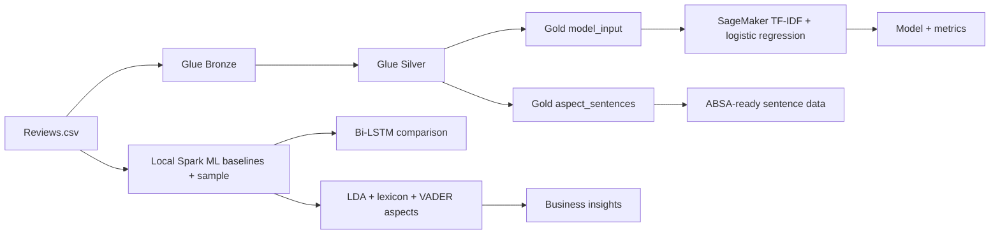

# Amazon Reviews Sentiment Analysis ML Pipeline

An end-to-end big-data and machine-learning project for classifying sentiment in Amazon Fine Food Reviews and turning review text into food-specific, actionable insights. The primary implementation uses an AWS medallion data pipeline with AWS Glue and SageMaker; the repository also includes a local research workflow for comparing classical ML, deep learning, and aspect-based sentiment analysis.

## What the project does

- Ingests the Amazon Fine Food Reviews CSV without altering source values.
- Cleans, validates, enriches, and deduplicates reviews with PySpark.
- Converts star ratings into three sentiment classes and a binary ML target.
- Produces deterministic, label-stratified train, validation, and test data.
- Trains a TF-IDF + logistic regression classifier in SageMaker.
- Provides an experimental Bi-LSTM model for comparison.
- Detects food-related aspects such as taste, freshness, packaging, price, delivery, health, and portion size.
- Generates aspect rankings, trends, product-level breakdowns, CSV reports, and charts.

## Architecture



### Medallion data layers

| Layer | S3 location | Purpose |
| --- | --- | --- |
| Raw | `s3://amazon-food-reviews-ml-model/raw/Reviews.csv` | Original Amazon review CSV. |
| Bronze | `s3://amazon-food-reviews-ml-model/bronze/` | Lossless Snappy-compressed Parquet copy with ingestion metadata and a deterministic record ID. All source fields remain strings. |
| Silver | `s3://amazon-food-reviews-ml-model/silver/` | Typed, validated, HTML-cleaned, whitespace-normalized, product-safe deduplicated, and enriched reviews. Punctuation is retained for sentence analysis. |
| Gold model input | `s3://amazon-food-reviews-ml-model/gold/model_input/` | Globally deduplicated binary sentiment data, partitioned into deterministic 80/10/10 train, validation, and test splits. |
| Gold aspect input | `s3://amazon-food-reviews-ml-model/gold/aspect_sentences/` | Sentence-level reviews with product, rating, time, and helpfulness context. |

Ratings are mapped as follows:

| Score | Sentiment class | Binary label |
| --- | --- | --- |
| 1–2 | Negative | `0` |
| 3 | Neutral | Excluded from binary model input |
| 4–5 | Positive | `1` |

The Glue stages prepare data only; they do not train a model. Duplicate normalized review text is removed before Gold model splits are assigned, reducing text leakage across evaluation sets.

## Repository structure

```text
.
├── .github/workflows/glue-pipeline.yml  # Glue deployment and orchestration
├── glue_jobs/
│   ├── bronze.py                        # Raw CSV -> Bronze
│   ├── silver.py                        # Bronze -> Silver
│   ├── gold.py                          # Silver -> two Gold products
│   └── *.ipynb                          # AWS Glue Studio notebook versions
├── sagemaker/
│   ├── launch_training.py               # Submit SageMaker training job
│   ├── train.py                         # Train and serve sklearn pipeline
│   ├── requirements.txt                 # Training-container dependency
│   └── *.ipynb                          # SageMaker Studio experiments
├── final/
│   ├── stage1_pipeline.py                # Spark ML baselines
│   ├── stage1b_lstm.py                   # Bi-LSTM comparison model
│   ├── stage2_aspects.py                 # LDA + lexicon + VADER aspects
│   └── stage3_insights.py                # Tables, CSVs, and charts
├── src/                                  # Shared source package
├── tests/                                # Test package
├── .env.example                          # Local AWS variable template
└── requirements.txt                      # AWS SDK dependencies
```

## Prerequisites

For the AWS pipeline:

- An AWS account with an S3 bucket, AWS Glue jobs, and a SageMaker execution role.
- AWS credentials configured locally, or GitHub Actions authentication through OIDC.
- Python 3 and the dependencies in the root `requirements.txt`.
- The Amazon Fine Food Reviews dataset as `Reviews.csv`, with the columns `Id`, `ProductId`, `UserId`, `ProfileName`, `HelpfulnessNumerator`, `HelpfulnessDenominator`, `Score`, `Time`, `Summary`, and `Text`.

The Glue scripts currently use the bucket name `amazon-food-reviews-ml-model` directly. Change the S3 constants in all three scripts if your bucket differs.

## Setup

From the repository root on Windows PowerShell:

```powershell
python -m venv venv
.\venv\Scripts\Activate.ps1
python -m pip install --upgrade pip
pip install -r requirements.txt
Copy-Item .env.example .env
```

Configure your AWS profile and region in the shell or through the AWS CLI. The `.env` file is a template for local tooling; the Python scripts do not load it automatically.

Upload the source dataset:

```powershell
aws s3 cp Reviews.csv s3://amazon-food-reviews-ml-model/raw/Reviews.csv
```

## Run the AWS pipeline

### 1. Create the Glue jobs

Create three AWS Glue PySpark jobs with these exact names:

1. `amazon-reviews-bronze`
2. `amazon-reviews-silver`
3. `amazon-reviews-gold`

Give their execution role permission to read and write the project bucket. Each job must have an S3 script location configured; the GitHub Actions workflow discovers that location and uploads the matching repository script.

Run the jobs in Bronze → Silver → Gold order. Each script validates its input schema, checks that output is non-empty, and verifies the written row count.

### 2. Deploy with GitHub Actions

The workflow at `.github/workflows/glue-pipeline.yml` deploys and runs all three Glue jobs sequentially. Configure these GitHub repository variables:

- `AWS_ROLE_ARN`: an OIDC-assumable AWS role with access to the Glue jobs and their S3 script locations.
- `AWS_REGION`: the region containing the jobs.

The workflow runs manually through `workflow_dispatch`, or automatically when Glue scripts or the workflow are pushed to `main`.

### 3. Train in SageMaker

Install the root dependencies, then submit the training job:

```powershell
python sagemaker/launch_training.py `
  --role-arn arn:aws:iam::<account-id>:role/<sagemaker-role> `
  --region <aws-region> `
  --bucket amazon-food-reviews-ml-model `
  --gold-prefix gold/model_input
```

Important: pass `--gold-prefix gold/model_input`. The launcher's current default is `gold`, which also contains the incompatible `aspect_sentences` Parquet product.

Useful training options include `--instance-type`, `--max-features`, `--test-size`, `--c`, and `--no-wait`. By default, training uses one `ml.m5.large` instance and waits for completion.

The trainer builds a scikit-learn pipeline containing:

- TF-IDF features with unigrams and bigrams, up to 50,000 features.
- Logistic regression with balanced class weights.
- Accuracy, precision, recall, F1, a confusion matrix, and a classification report.

SageMaker writes `model.joblib` and `metrics.json` into the model artifact. The script also implements SageMaker inference hooks accepting JSON in this form:

```json
{"texts": ["excellent flavor and fresh packaging", "stale and overpriced"]}
```

The response contains binary predictions and positive-class probabilities.

> The Gold job creates explicit `dataset_split` partitions, but the current SageMaker trainer loads all supplied Parquet files and performs its own stratified validation split. Pointing the input at a specific Gold partition, or updating the trainer to honor `dataset_split`, is required when evaluating strictly against the precomputed splits.

## Local research workflow

The scripts in `final/` are an alternative, sequential experimentation path. They require additional packages that are not pinned in the root requirements file: PySpark, pandas, NumPy, scikit-learn, PyArrow, TensorFlow, NLTK, and Matplotlib.

Place `Reviews.csv` in the repository root, then run:

```powershell
python final/stage1_pipeline.py
python final/stage1b_lstm.py
python final/stage2_aspects.py
python final/stage3_insights.py
```

The stages perform the following work:

1. `stage1_pipeline.py` cleans the data, creates a balanced sample, compares Spark logistic regression, linear SVM, and Naive Bayes on balanced and realistic test sets, and writes `sample_stage1.parquet`.
2. `stage1b_lstm.py` trains a TensorFlow Bi-LSTM on the Stage 1 sample for a deep-learning comparison.
3. `stage2_aspects.py` validates seeded food aspects with LDA and applies sentence-level VADER sentiment, writing `aspect_sentiment.parquet`. NLTK resources may be downloaded on first run.
4. `stage3_insights.py` ranks negative aspects, applies helpfulness weighting, analyzes yearly trends, and creates product-level breakdowns.

Stage 3 outputs include:

- `insight_aspect_ranking.csv`
- `insight_aspect_trend.csv` when time metadata is present
- `insight_product_breakdown.csv` when product metadata is present
- `chart_aspect_negativity.png`
- `chart_aspect_trend.png` when time metadata is present

## Reproducibility and data-quality choices

- Spark and ML sampling use a fixed seed of `42`.
- Bronze preserves every source row and verifies lossless output.
- Silver rejects invalid IDs, ratings, text, and helpfulness values.
- Silver deduplicates within a product while retaining cross-product copies for analytics.
- Gold removes identical normalized text globally for the binary classifier.
- Class balancing belongs only in training; validation and test distributions should remain representative.
- Punctuation is preserved in the AWS Silver and Gold aspect path so sentence boundaries remain available for aspect analysis.

## Cost and cleanup

AWS Glue runs, SageMaker training instances, and S3 storage can incur charges. After experimentation, stop unused notebook resources, remove unneeded training artifacts, and apply an S3 lifecycle policy appropriate for the project.
